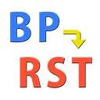

# Unreal Engine Plugin: Blueprint to reStructuredText Document

This is a Unreal Engine plugin to generate reStructuredText format documents
from Blueprints.

## Features

* Generate reStructuredText (RST) documents from Blueprints.

## Supported Environment

* Unreal Engine Version: 4.25-4.27, 5.0-
* Development Platforms: Windows, macOS, Linux
* Target Build Platforms: All platforms

## Installation

See [the installation document](docs/installation.md).

## Tutorial

See [the tutorial](docs/tutorial.md).

## Change Log

See [CHANGELOG.md](CHANGELOG.md).

If you want to report problems or request features, please
[make issues](https://github.com/nutti/UEPlugin-BlueprintToRSTDoc/issues).  
You can also discuss about this plugin at [Discord (blueprint-to-rst-doc channel)](https://discord.gg/AtjNyRtT97).

## Contribution

If you want to contribute to this project, see [.github/CONTRIBUTING.md](.github/CONTRIBUTING.md).

## Project Authors

### Owner

[**@nutti**](https://github.com/nutti)

Indie Game/Application Developer.  
Especially, I spend most time to improve Blender and Unreal Game Engine via
providing the extensions.

Support via [GitHub Sponsors](https://github.com/sponsors/nutti)

* CONTACTS: [Twitter](https://twitter.com/nutti__)
* WEBSITE: [Japanese Only](https://colorful-pico.net/)

### Acknowledgments

This plugin refers source code files in [historia-Inc/BlueprintToDoc](https://github.com/historia-Inc/BlueprintToDoc)
which is one of [historia-Inc](https://historia.co.jp/)'s project.
