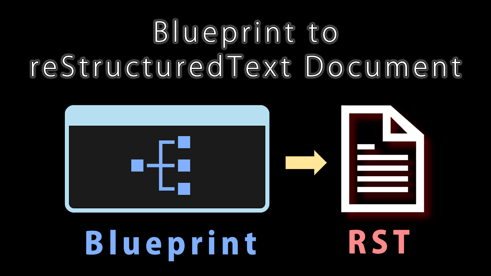

# UE4 Plugin: BlueprintToRSTDoc

This is a UE4 plugin to generate reStructuredText format documents from Blueprints.

## Supported Environment

* UE4 Version: 4.25
* OS: Windows

## Download / Installation

All released BlueprintToSphinxDoc plugin is availabled on [Release Page](https://github.com/nutti/UE4-BlueprintToRSTDoc/releases).  
If you want to try newest (unstable) version, you can download it from [unstable version](https://github.com/nutti/UE4-BlueprintToRSTDoc/archive/main.zip).

See [Document](docs/installation.md) if you have any trouble to install this add-on.

## Tutorial

See [Document](docs/tutorial.md).

## Change Log

See [CHANGELOG.md](CHANGELOG.md).

## Bug report / Feature request / Disscussions

If you want to report bug, request features or discuss about this add-on, see [ISSUES.md](ISSUES.md).

## Contribution

If you want to contribute to this project, see [CONTRIBUTING.md](CONTRIBUTING.md).

## Project Authors

### Owner

[**@nutti**](https://github.com/nutti)

Indie Game/Application Developer.  
Especially, I spend most time to improve Blender and Unreal Game Engine via providing the extensions.

Support via [GitHub Sponsors](https://github.com/sponsors/nutti)

* CONTACTS: [Twitter](https://twitter.com/nutti__)
* WEBSITE: [Japanese Only](https://colorful-pico.net/)

### Acknowledgments

This plugin refers source code files in [historia-Inc/BlueprintToDoc](https://github.com/historia-Inc/BlueprintToDoc) which is one of [historia-Inc](https://historia.co.jp/)'s project.
