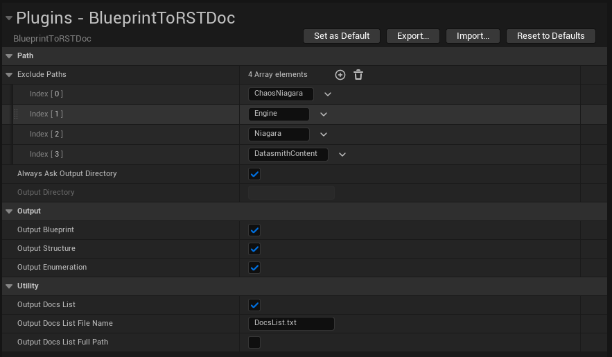
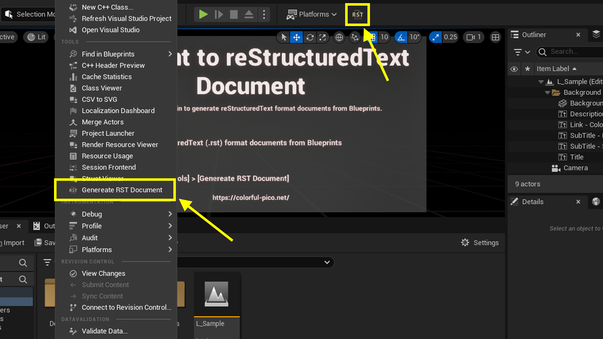

# Tutorial

## 1. Configure documents generation settings

The configuration for this plugin is available on *Settings* >
*Project Settings...* > *Plugins* > *BlueprintToRSTDoc*.

<!-- markdownlint-disable MD013 -->
<!-- markdownlint-disable MD033 -->

|**Category**|**Item**|**Description**|
|---|---|---|
|Path|Exclude Paths|Exclude files for generating documents under this paths.|
||Always Ask Output Directory|Always ask output directory when you generate documents.|
||Output Directory|Output directory of generated documents. This setting is available when *Always Ask Output Directory* is off.|
|Output|Blueprint|Output documents of Blueprint when this setting is on.|
||Structure|Output documents of Structure when this setting is on.|
||Enumeration|Output documents of Enumeration when this setting is on.|
|Document List|Output|Output a document list when this setting is on.|
||File Name|File name of a document list.|
||Full File Path|When this setting is on, output full file path of documents.|

<!-- markdownlint-enable MD033 -->
<!-- markdownlint-enable MD013 -->

## 2. Generate documents

1. Click *BlueprintToRSTDoc* button or execute *Tools* > *Generate RST Document*.
2. Specify the output directory of generated documents from the opened window.
   (This process will be skipped when the setting *Path* >
   *Always Ask Output Directory* is off.)
3. Message box will be popped up after documents generated.

Generated documents are located on the specified directory.

## 3. Use Sphinx to generate pretty documents (Optional)

You can use [Sphinx](https://www.sphinx-doc.org/en/master/) to generate more
sophisticated document.  
See the document pages for detail.
